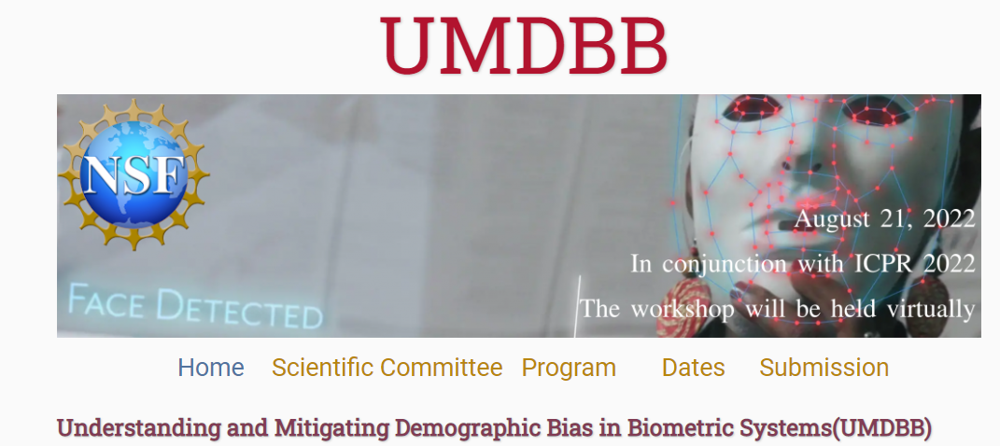

# Understanding and Mitigating Demographic Bias in Biometric Systems (UMDBB)

Template for the 2022 [UMDBB](https://data-science-conference.github.io/) jointly organized by Ajita Rattani and Michael King.  
Original template by [Mike Pierce](https://github.com/mikepierce).

